## :copyright: Autor

- :camera: 

- :man: **Daniel Morales**
- :e-mail: danielaugustoma@unitec.edu
- :link: [https://github.com/D11110](https://github.com/D11110)
- :calendar: 2020-09-20 23:00 CST

---

## :dart: Objetivos

Punto de control de **C++** #09:

:blue_book: Comprender los temas de la semana, en esta se vieron temas como:
   - **Archivos de texto**
   - **Archivos binarios**

---

## :black_circle: acceso_aleatorio.cpp

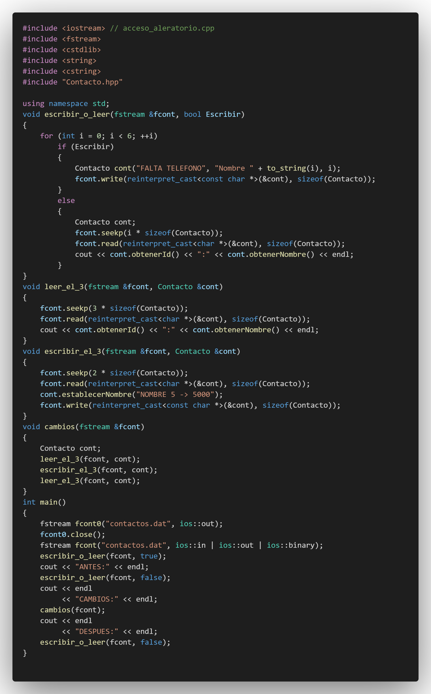

---

## :white_circle: Salida

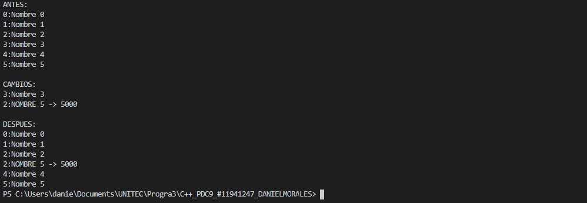

---

## :triangular_ruler: archivos1.cpp

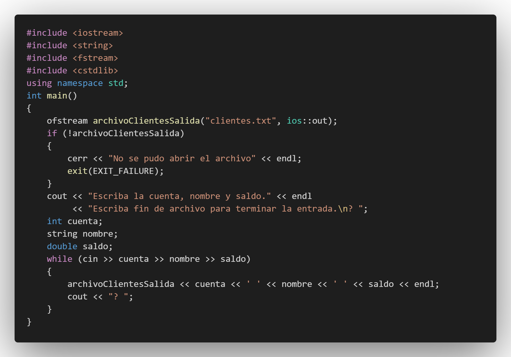

---

## :white_circle: Salida

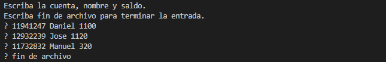

---

## :triangular_ruler: archivos2.cpp

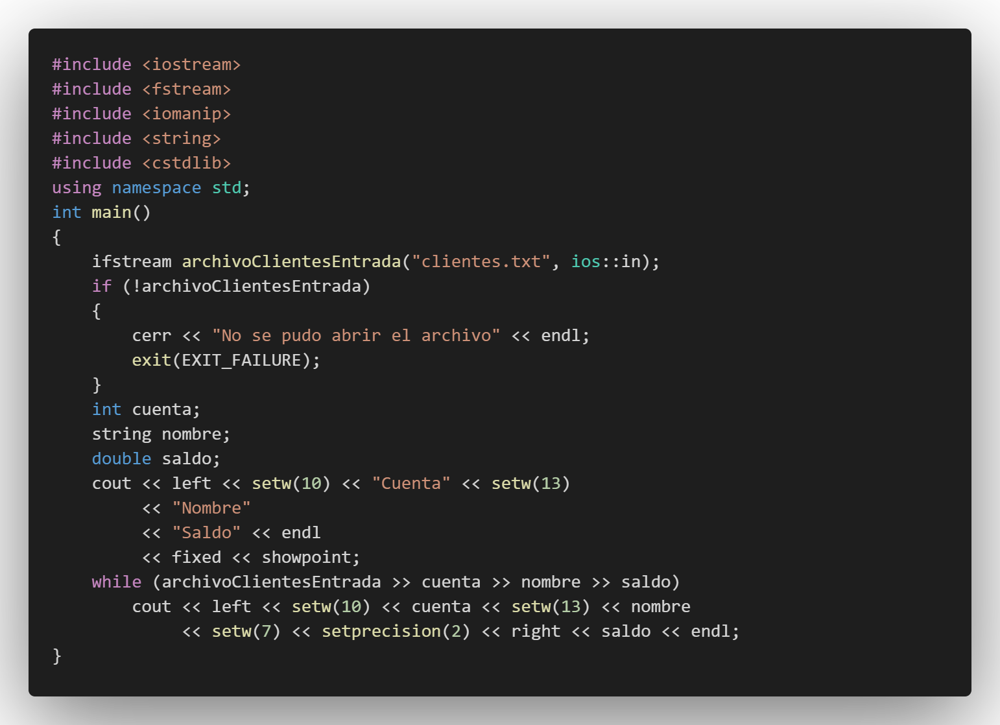

---

## :white_circle: Salida

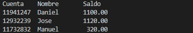

---

## :black_circle: cin_y_cin-get.cpp

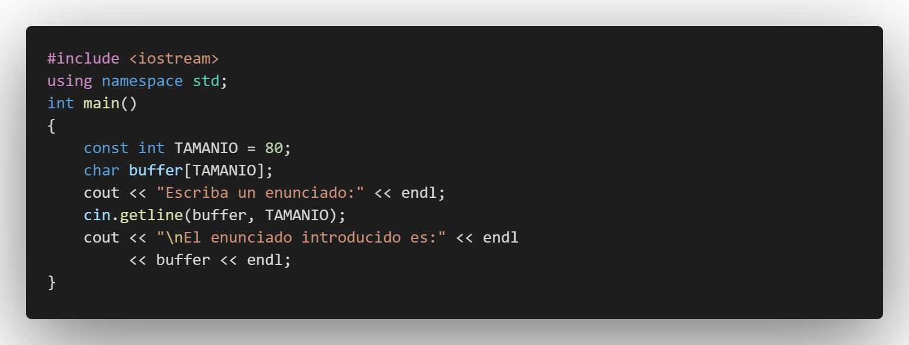

---

## :white_circle: Salida

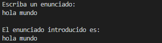

---

## :white_large_square: cin-getline.cpp

---

## :white_circle: Salida

---

## :black_circle: cout-setw.cpp

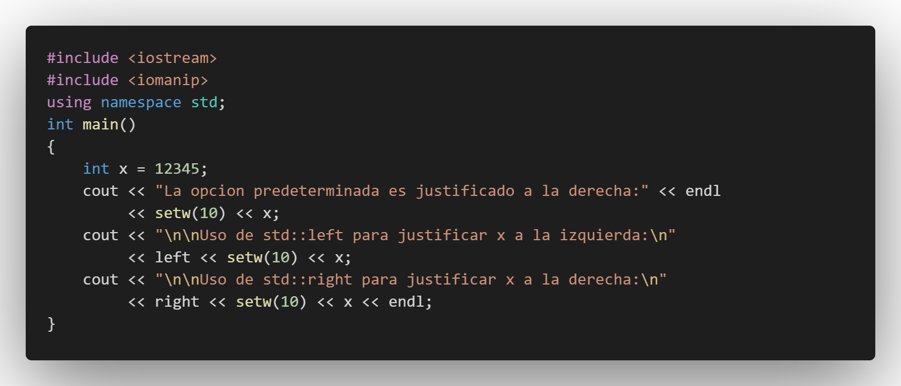

---

## :white_circle: Salida

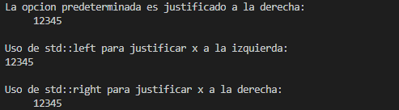

---

## :black_circle: cout-setw2.cpp

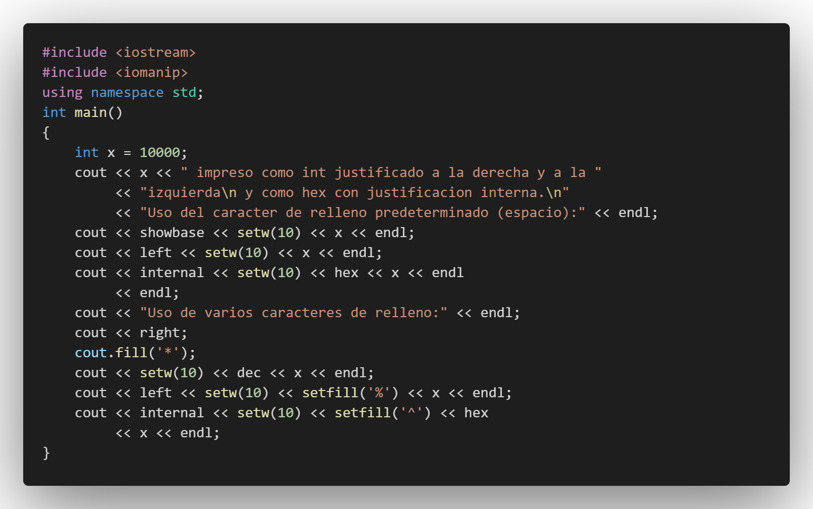

---

## :white_circle: Salida

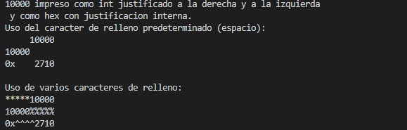

---

## :black_circle: cout-width.cpp

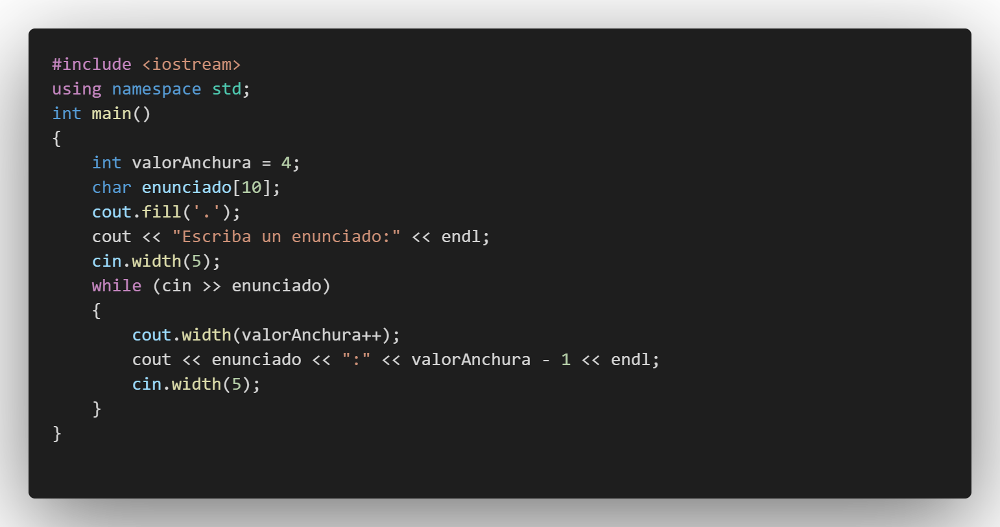

---

## :white_circle: Salida

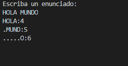

---

## :black_circle: dec_oct_hex_y_setbase.cpp

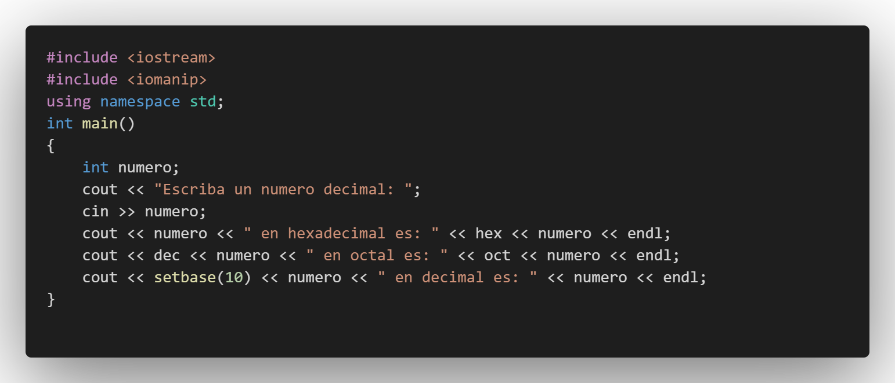

---

## :white_circle: Salida

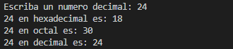

---

## :black_circle: dec_oct_hex_y_setbase2.cpp

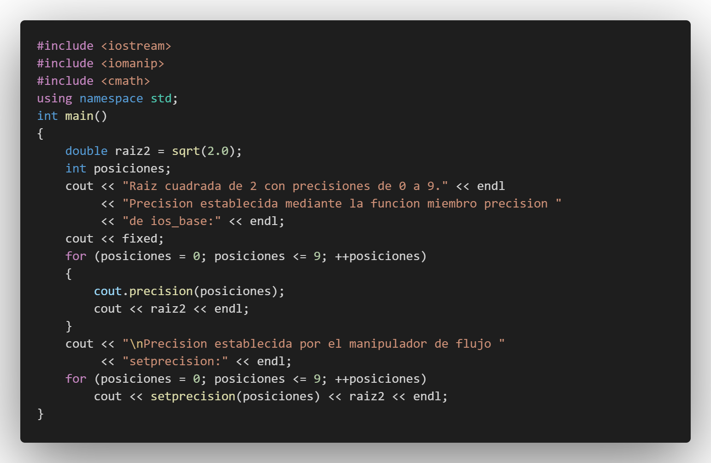

---

## :white_circle: Salida

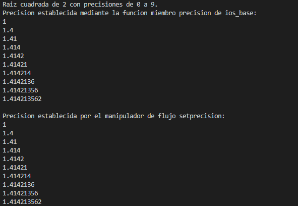

---

## :black_circle: eof_get_y_put.cpp

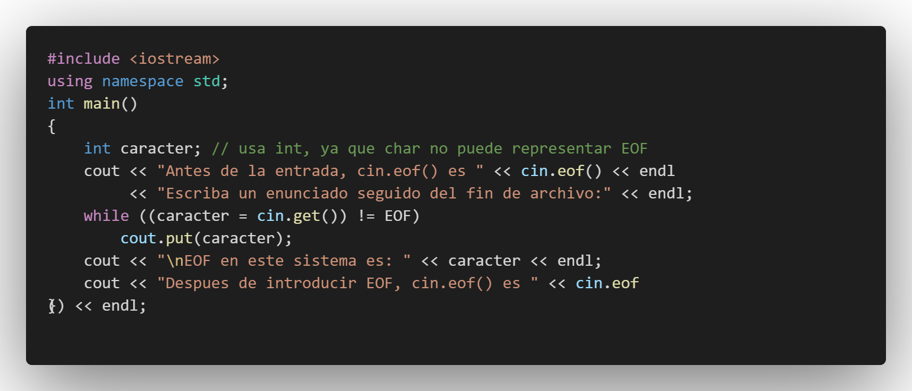

---

## :white_circle: Salida

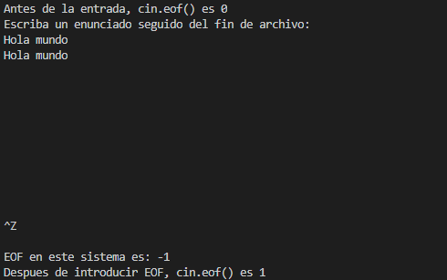

---

## :black_circle: read_y_write.cpp

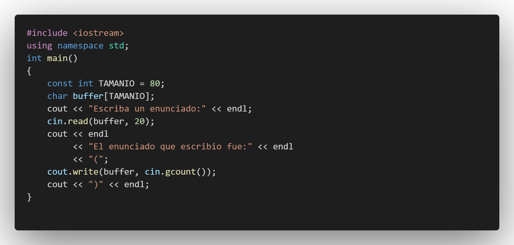

---

## :white_circle: Salida

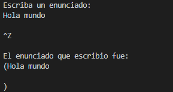

---

## :black_circle: scientific_y_fixed.cpp

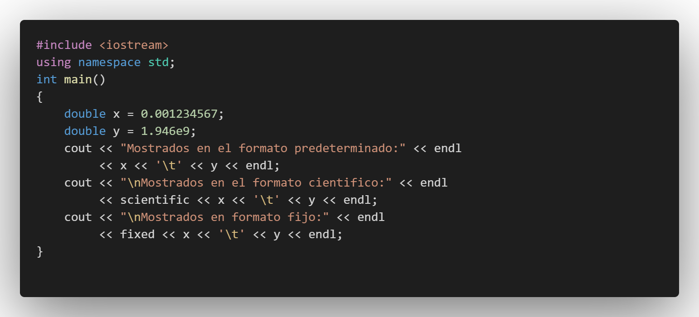

---

## :white_circle: Salida

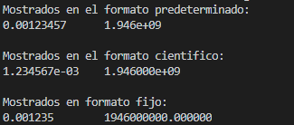

---

## ASIGNACION 3
## -

---

## :black_circle: Operaciones.cpp

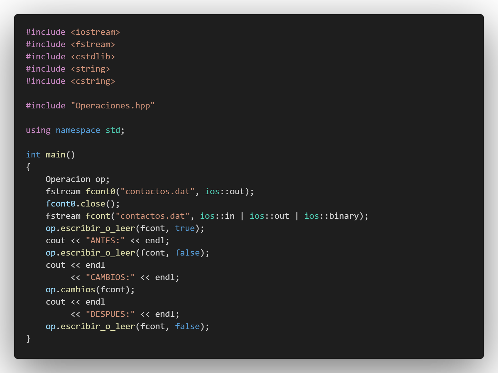

---

## :white_circle: Operaciones.hpp

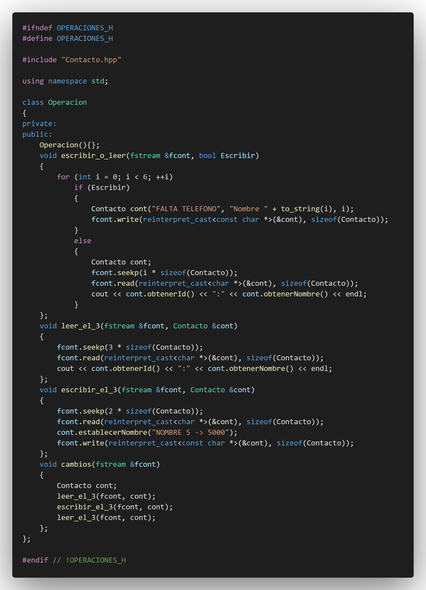

---

## :white_circle: Contacto.hpp

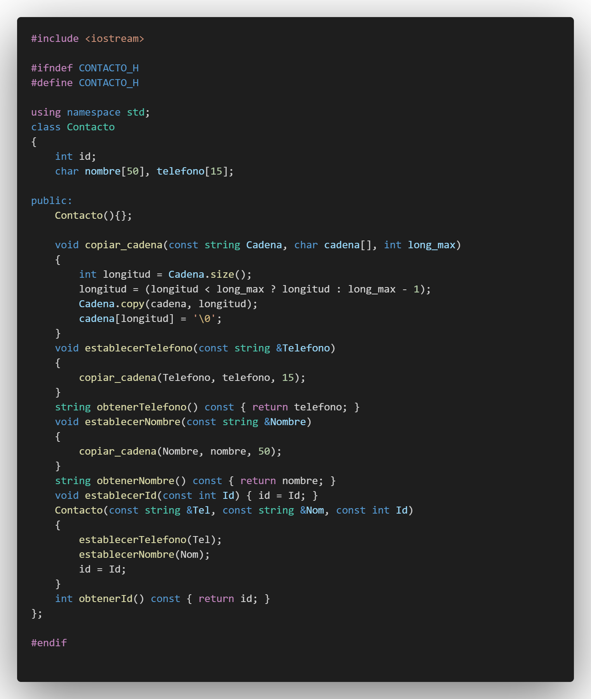

---

## :computer: Código

- :blue_book: [C-_PDC_-09](https://github.com/D11110/C-_PDC_-09)

---
#### Herramientas:
- :package: [Visual Studio Code](https://code.visualstudio.com/)
- :camera: [Polacode-2020 v0.5.2](https://github.com/jeff-hykin/polacode)
- :notebook: [Markdown Cheatsheet](https://github.com/adam-p/markdown-here/wiki/Markdown-Cheatsheet)
- :smile: [Emoji Cheat Sheet](https://www.webfx.com/tools/emoji-cheat-sheet/)